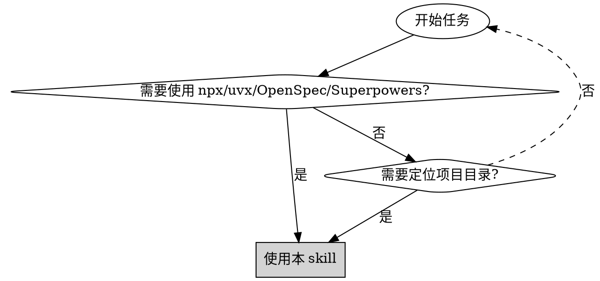

# 前置条件检查

## 概述

自动化环境检查和配置工具，确保项目所需的工具、依赖项、OpenSpec 指令文件和 Superpowers Skills 正确安装。默认使用无人工交互策略完成初始化。

## 参数模式

支持以下调用方式：

```text
/pre-check
/pre-check no-interrupt
/pre-check --no-interrupt
```

- 命令参数包含完整 token `no-interrupt` 或 `--no-interrupt`：进入 `no-interrupt` 模式。
- 未携带上述参数：进入普通模式，完整遵循本 Skill 修改前的检查、交互、增量安装、冲突跳过和失败后继续策略。
- 两种模式互斥；不得把 `no-interrupt` 规则应用到普通模式。

### no-interrupt 通用规则

- 禁止调用 `AskUserQuestion`、`request_user_input` 或等价用户提问工具。
- 禁止等待用户输入、设置交互超时或通过推荐默认值继续。
- 不询问、不收集 API Key、Token、密码等私密信息。
- 不绕过操作系统权限、网络授权或执行平台安全限制；缺少必要条件时按失败处理。
- 失败报告必须包含失败步骤、失败原因、已完成步骤和恢复建议，不得宣称初始化成功。

### no-interrupt 强制完成策略

除 Playwright 外，六个基础检查都是完成门槛。已安装且验证通过视为完成，不重复安装；缺失时必须安装并验证。任一项失败立即终止 `/pre-check`，不执行剩余检查、API Key 提醒或下游初始化 Skill。

| 项目 | 完成条件 | 失败动作 |
|------|----------|----------|
| npx | `npx --version` 成功 | 立即终止 |
| uvx | `uvx --version` 成功 | 立即终止 |
| ast-grep | `ast-grep --version` 成功 | 立即终止 |
| codegraph | `codegraph version` 成功 | 立即终止 |
| OpenSpec | CLI 和 claude/codex/pi 三客户端目标指令文件验证成功（`openspec/config.yaml` 缺失不算失败，仅提示由 rule-config 创建） | 立即终止 |
| Superpowers | 来源目录和四层 Skills 软链验证成功 | 立即终止 |
| pi MCP Adapter | 条件项：`command -v pi` 成功时 adapter 安装并验证成功；pi 可执行文件不存在时跳过 | pi 可执行文件存在但安装失败：立即终止 |
| Playwright | 仅用户明确要求时安装和验证 | 未要求时允许跳过 |

`no-interrupt` 模式不得把安装失败、验证失败或配置冲突降级为警告后继续。

### no-interrupt Superpowers 处理

1. 先验证 `~/.agents/superpowers/skills`；有效时按现有同步逻辑完成四层软链。
2. 来源目录无效或缺失时，尝试在线 clone 或 Git 更新。
3. 在线操作失败后，只允许校验固定离线目录 `~/.agents/superpowers/skills`，不询问其他离线来源路径。
4. 固定离线目录仍无效时立即报错，终止 `/pre-check`。
5. Superpowers 来源目录或软链目标存在同名非软链内容时，将冲突内容重命名为 `<原名称>.cadence-backup-YYYYMMDDHHMMSS`，再创建正确目录或软链并验证。
6. 备份、创建或验证任一步失败时立即终止；禁止删除原内容，也禁止跳过冲突项继续。

**核心原则**：检查-验证-安装-同步-记录

**强制规则**：
1. **所有交互必须使用中文** - 提示、错误消息、用户询问一律中文
2. **必须完成所有六个基础检查** - 不允许跳过 npx/uvx/ast-grep/codegraph/openspec/superpowers 任一步骤
3. **必须支持增量运行** - 老项目重新运行 `/pre-check` 时，只补齐缺失能力，不重装、不覆盖已就绪配置
4. **Superpowers 必须支持离线安装** - 用户可手动复制 `superpowers` 到 `~/.agents/superpowers`
5. **Playwright 默认跳过** - 仅用户明确要求浏览器自动化能力时才安装 playwright-cli 与 skills
6. **API Key 配置默认占位** - 不询问、不收集真实密钥；mcp-configuration 默认写入智普/MiniMax API Key 占位配置，并提醒用户后续自行替换

## 人工交互策略

> 本节仅适用于未携带 `no-interrupt` 或 `--no-interrupt` 的普通模式。

默认不向用户提问。只有出现以下情况才进入人工交互：

| 触发条件 | 处理方式 |
|----------|----------|
| 在线安装失败且存在离线安装路径选择 | 询问用户是否已准备离线目录；无法等待时报告离线复制路径并继续其他检查 |
| Superpowers 目标目录存在同名非软链 | 不覆盖；如用户明确要求替换，再询问并执行 |
| 用户明确要求安装 Playwright | 检查并安装；安装失败时提供手动命令 |
| 需要真实 API Key、Token 或私密信息 | 不询问真实密钥，只提醒后续替换占位符 |

提问规则：
- 每次只问一个问题。
- 问题必须给出推荐默认选项。
- 如果运行环境支持自动超时，超时后采用推荐默认值。
- 如果无法等待用户输入，采用保守默认：不覆盖、不删除、不收集真实密钥、不启用 Playwright。

## 何时使用



**使用场景**：环境初始化、CI/CD 环境准备、新开发者环境搭建、新版 Cadence 工具补齐、OpenSpec 指令文件补齐、Superpowers Skills 同步

**不适用场景**：全部工具已确认安装、仅需检查单个工具、非开发环境

## 增量运行

`/pre-check` 支持重复执行。每个工具独立检查，**已安装或已同步的项目会直接跳过，只补装、补齐、更新缺失项**，不会重复安装或破坏已有配置。

增量原则：
- 已就绪：跳过并报告当前状态。
- 缺失：安装、初始化或补齐。
- 部分存在：只修复缺失部分。
- 冲突存在：不覆盖用户文件，中文警告并给出人工处理建议。
- 单项失败：报告失败和手动命令，其他已就绪项不回滚。

典型场景：
- 框架新增 `ast-grep` 后，老项目重新运行 `/pre-check`，只会自动安装 `ast-grep`，不会影响已有的 `npx`、`uvx`、`playwright-cli`。
- 框架新增 `codegraph` 后，老项目重新运行 `/pre-check`，只会自动安装 `codegraph`，不会影响已有工具。
- 框架新增 OpenSpec pi 支持后，老项目重新运行 `/pre-check`：缺少 `.pi` 产物时先执行 `openspec init --tools pi`，再执行 `openspec update`；若 pi 产物已存在，则直接执行 `openspec update`。新项目或三客户端产物均缺失时执行 `openspec init --tools claude,codex,pi`。
- 框架新增 Superpowers 后，老项目重新运行 `/pre-check`，只会更新或识别 `~/.agents/superpowers`，补齐 `~/.agents/skills`、`~/.codex/skills/skills`、`~/.claude/skills`、`~/.pi/agent/skills` 的软链。
- 某个工具安装失败后修复了环境问题，重新运行 `/pre-check` 会再次尝试安装或同步该工具。

## 检查流程

```dot
digraph check_flow {
    rankdir=TB;
    node [shape=box, style="rounded"];

    start [label="开始检查", shape=ellipse];

    check_npx [label="检查 npx", shape=diamond];
    install_npx [label="安装 npx"];
    npx_done [label="npx 就绪"];

    check_uvx [label="检查 uvx", shape=diamond];
    install_uvx [label="安装 uvx"];
    uvx_done [label="uvx 就绪"];

    check_ast_grep [label="检查 ast-grep", shape=diamond];
    install_ast_grep [label="安装 ast-grep"];
    ast_grep_done [label="ast-grep 就绪"];

    check_codegraph [label="检查 codegraph", shape=diamond];
    install_codegraph [label="安装 codegraph"];
    codegraph_done [label="codegraph 就绪"];

    check_openspec [label="检查 OpenSpec", shape=diamond];
    install_openspec [label="安装 OpenSpec CLI"];
    sync_openspec [label="初始化或更新 OpenSpec 指令文件"];
    openspec_done [label="OpenSpec 就绪"];

    check_superpowers [label="检查 Superpowers", shape=diamond];
    clone_superpowers [label="在线 clone 或提示离线复制"];
    sync_superpowers [label="更新仓库并同步软链"];
    superpowers_done [label="Superpowers 就绪"];

    check_pi_mcp [label="PATH 中存在 pi 可执行文件?", shape=diamond];
    install_pi_mcp [label="检查/安装 pi-mcp-adapter"];
    skip_pi_mcp [label="跳过 pi MCP Adapter 检查"];
    optional_playwright [label="用户明确要求时安装 Playwright", shape=box];
    remind_apikey [label="默认展示 API Key 占位提醒"];

    end [label="检查完成", shape=ellipse];

    start -> check_npx;
    check_npx -> install_npx [label="未安装"];
    check_npx -> check_uvx [label="已安装"];
    install_npx -> npx_done;
    npx_done -> check_uvx;

    check_uvx -> install_uvx [label="未安装"];
    check_uvx -> check_ast_grep [label="已安装"];
    install_uvx -> uvx_done;
    uvx_done -> check_ast_grep;

    check_ast_grep -> install_ast_grep [label="未安装"];
    check_ast_grep -> check_codegraph [label="已安装"];
    install_ast_grep -> ast_grep_done;
    ast_grep_done -> check_codegraph;

    check_codegraph -> install_codegraph [label="未安装"];
    check_codegraph -> check_openspec [label="已安装"];
    install_codegraph -> codegraph_done;
    codegraph_done -> check_openspec;

    check_openspec -> install_openspec [label="CLI 未安装"];
    check_openspec -> sync_openspec [label="CLI 已安装"];
    install_openspec -> sync_openspec;
    sync_openspec -> openspec_done;
    openspec_done -> check_superpowers;

    check_superpowers -> clone_superpowers [label="来源缺失"];
    check_superpowers -> sync_superpowers [label="来源存在"];
    clone_superpowers -> sync_superpowers;
    sync_superpowers -> superpowers_done;
    superpowers_done -> check_pi_mcp;
    check_pi_mcp -> install_pi_mcp [label="是"];
    check_pi_mcp -> skip_pi_mcp [label="否"];
    install_pi_mcp -> optional_playwright;
    skip_pi_mcp -> optional_playwright;
    optional_playwright -> remind_apikey;
    remind_apikey -> end;
}
```



## 快速参考

| 步骤 | 检查命令或路径 | 成功标志 | 失败处理 |
|------|----------------|----------|----------|
| **1. npx** | `npx --version` | 输出版本号 | 自动安装稳定版本 |
| **2. uvx** | `uvx --version` | 输出版本号 | 自动安装稳定版本 |
| **3. ast-grep** | `ast-grep --version` | 输出版本号 | 自动全局安装 `@ast-grep/cli` |
| **4. codegraph** | `codegraph version` | 输出版本号 | 自动全局安装 `@colbymchenry/codegraph` |
| **5. OpenSpec** | `openspec --version`、三客户端产物状态 | CLI 和所需指令文件存在；`openspec/config.yaml` 缺失仅提示不影响判定 | 按缺失客户端 `init --tools <缺失客户端>` 后 `update` |
| **6. Superpowers** | `~/.agents/superpowers/skills` | 四层软链同步完成 | 在线 clone；失败时提示离线复制 |
| **7. pi MCP Adapter（条件）** | `command -v pi >/dev/null 2>&1`；就绪判定为 `pi list` 含 `pi-mcp-adapter` 或 `~/.pi/agent/npm/node_modules/pi-mcp-adapter` 存在 | pi 可执行文件存在时 adapter 已安装；不存在时跳过 | pi 可执行文件存在且 adapter 缺失时执行 `pi install npm:pi-mcp-adapter` |
| **可选. playwright-cli** | 用户明确要求时检查 `playwright-cli --help` | 输出帮助信息 | 自动全局安装并安装 skills |
| **默认提醒. API Key** | 展示占位配置提醒 | 用户后续自行替换真实密钥 | 不收集、不验证密钥 |

## 实施步骤

### 步骤 1：检查 npx

```bash
npx --version
```

**行为（中文输出）**：
- 已安装：报告 "✓ npx 已安装（版本：{版本号}）"
- 未安装：报告 "正在安装 npx..."，自动安装，完成后报告 "✓ npx 安装成功"

### 步骤 2：检查 uvx

```bash
uvx --version
```

**行为（中文输出）**：
- 已安装：报告 "✓ uvx 已安装（版本：{版本号}）"
- 未安装：报告 "正在安装 uvx..."，自动安装，完成后报告 "✓ uvx 安装成功"

### 可选步骤：检查 playwright-cli

> 默认不执行。仅当用户明确要求浏览器自动化、截图、表单填写、端到端测试能力时执行。

```bash
playwright-cli --help
```

**行为（中文输出）**：
- 未明确要求：报告 "✓ 默认跳过 playwright-cli 安装，可稍后按需启用"
- 已明确要求且已安装：报告 "✓ playwright-cli 已安装"
- 已明确要求但未安装：报告 "正在安装 playwright-cli..."，执行全局安装与 skills 安装，完成后报告 "✓ playwright-cli 与 skills 安装成功"

**安装命令**：

```bash
npm install -g @playwright/cli@latest
playwright-cli install --skills
```

**验证安装**：

```bash
playwright-cli --help
ls ~/.claude/skills/playwright-cli
```

**说明**：

- **用途**：浏览器自动化测试、表单填写、截图、数据提取
- **特点**：Token-efficient，不会强制将页面数据加载到 LLM
- **Skills**：安装后 Claude Code 可自动识别并使用 Playwright skills
- **默认行为**：不安装、不启用；需要时由用户显式要求

### 步骤 3：检查 ast-grep

```bash
ast-grep --version
```

**行为（中文输出）**：
- 已安装：报告 "✓ ast-grep 已安装（版本：{版本号}）"
- 未安装：报告 "正在安装 ast-grep..."，执行 `npm i @ast-grep/cli -g`，完成后报告 "✓ ast-grep 安装成功"

**安装命令**：

```bash
npm i @ast-grep/cli -g
```

### 步骤 4：检查 codegraph

```bash
codegraph version
```

**行为（中文输出）**：
- 已安装：报告 "✓ codegraph 已安装（版本：{版本号}）"
- 未安装：报告 "正在安装 codegraph..."，执行 `npm i -g @colbymchenry/codegraph`，完成后报告 "✓ codegraph 安装成功"

**安装命令**：

```bash
npm i -g @colbymchenry/codegraph
```

**增量要求**：
- 如果老项目已完成 `/pre-check`，重新运行时必须跳过已安装工具，只补装缺失的 codegraph。
- codegraph 安装后只验证 codegraph，不重新安装 npx/uvx/ast-grep。

### 步骤 5：检查 OpenSpec

```bash
openspec --version
```

**行为（中文输出）**：
- CLI 已安装：报告 "✓ OpenSpec CLI 已安装（版本：{版本号}）"
- CLI 未安装：报告 "正在安装 OpenSpec CLI..."，执行 `npm install -g @fission-ai/openspec@latest`，完成后再次验证
- `openspec/config.yaml` 不存在：报告 "ℹ openspec/config.yaml 尚未创建，将由 rule-config 步骤 11 创建（含 Cadence 协作规则上下文），不阻塞本检查"

**安装命令**：

```bash
npm install -g @fission-ai/openspec@latest
```

**初始化与更新命令**：

```bash
# 新项目：当前项目尚未存在 openspec/config.yaml
openspec init --tools claude,codex,pi

# 老项目：已存在 openspec/config.yaml，但缺少 .pi skills 或 prompts
openspec init --tools pi
openspec update

# 老项目：pi skills 与 prompts 已存在
openspec update
```

**增量要求**：

按 claude、codex、pi 三客户端分别检测指令产物存在性，`openspec/config.yaml` 是否存在不作为分支判断条件：

| 客户端 | 产物就绪判定 |
|--------|--------------|
| claude | `.claude/commands/opsx/` 存在，或 `.claude/skills/` 下存在 `openspec-*` 目录 |
| codex | `.codex/skills/` 下存在 `openspec-*` 目录 |
| pi | `.pi/skills/` 下恰有 5 个 `openspec-*` 目录，且 `.pi/prompts/` 下恰有 5 个 `opsx-*.md` 文件 |

- 存在缺失客户端：对缺失客户端执行 `openspec init --tools <缺失客户端列表>`（如 `claude,codex,pi`、`pi`），再执行 `openspec update`。
- 三客户端产物均齐全：直接执行 `openspec update`。
- 已就绪客户端不得重新 init，不覆盖用户改动。
- `openspec init` 检测到 `openspec/config.yaml` 已存在时原样保留（CLI 行为），不覆盖 rule-config 写入的内容。
- `openspec update` 只刷新已初始化的工具产物，不能为未初始化的客户端新增产物；缺失客户端必须由 `openspec init` 补齐。
- OpenSpec 生成的 Claude Code、Codex 和 pi 目录结构不同，不能混用：
  - Claude Code：`.claude/commands/opsx/`、`.claude/skills/openspec-*`
  - Codex：`.codex/skills/openspec-*`
  - pi：`.pi/prompts/opsx-*`、`.pi/skills/openspec-*`
- `--tools pi` 需要 OpenSpec CLI >= 1.4.1；`/pre-check` 的安装命令始终安装 `@fission-ai/openspec@latest`，版本不足时先升级 CLI。
- 已存在的 OpenSpec skills 或 commands 不删除、不覆盖用户改动；如 `openspec update` 产生冲突，报告冲突并提示用户手动处理。

**验证命令**：

```bash
openspec --version
test -f .codex/skills/openspec-propose/SKILL.md
test -f .claude/commands/opsx/propose.md -o -f .claude/skills/openspec-propose/SKILL.md
test -f .pi/skills/openspec-propose/SKILL.md
test "$(find .pi/skills -mindepth 1 -maxdepth 1 -type d -name 'openspec-*' | wc -l | tr -d ' ')" = 5
test "$(find .pi/prompts -mindepth 1 -maxdepth 1 -type f -name 'opsx-*.md' | wc -l | tr -d ' ')" = 5
```

> 说明：`openspec/config.yaml` 由 rule-config 步骤 11 创建与合并，不属于本检查的完成条件；缺失时仅按"行为（中文输出）"输出提示。

### 步骤 6：检查 Superpowers

**目录约定**：

| 用途 | 路径 |
|------|------|
| Superpowers 源目录 | `~/.agents/superpowers` |
| 统一 Skills 目录 | `~/.agents/skills` |
| Codex 目标目录 | `~/.codex/skills/skills` |
| Claude Code 目标目录 | `~/.claude/skills` |
| pi 目标目录 | `~/.pi/agent/skills` |

**在线安装来源**：

```bash
git clone https://github.com/obra/superpowers "$HOME/.agents/superpowers"
```

**离线安装方式**：

用户可自行下载或复制 Superpowers 到：

```bash
$HOME/.agents/superpowers
```

只要存在以下目录，即视为有效离线来源：

```bash
$HOME/.agents/superpowers/skills
```

**行为（中文输出）**：
- `~/.agents/superpowers/.git` 存在：执行 Git 更新逻辑，然后同步软链。
- `~/.agents/superpowers/.git` 不存在但 `~/.agents/superpowers/skills` 存在：报告 "检测到 Superpowers 离线安装目录，跳过 Git 更新"，继续同步软链。
- `~/.agents/superpowers/skills` 不存在：尝试在线 clone；如果失败，提示用户离线复制 Superpowers 到 `~/.agents/superpowers` 后重新运行 `/pre-check`。

**Git 更新逻辑**：

```bash
cd "$HOME/.agents/superpowers"
git fetch --all
git rev-parse --abbrev-ref --symbolic-full-name @{u}
git pull --ff-only
```

**软链同步逻辑**：

1. 确保 `~/.agents/skills`、`~/.codex/skills/skills`、`~/.claude/skills`、`~/.pi/agent/skills` 存在。
2. 将 `~/.agents/superpowers/skills/*` 逐项软链到 `~/.agents/skills`。
3. 将 `~/.agents/skills/*` 中指向 Superpowers 的软链逐项软链到 `~/.codex/skills/skills`。
4. 将 `~/.agents/skills/*` 中指向 Superpowers 的软链逐项软链到 `~/.claude/skills`。
5. 将 `~/.agents/skills/*` 中指向 Superpowers 的软链逐项软链到 `~/.pi/agent/skills`。
6. 已存在正确软链：跳过。
7. 已存在旧软链但指向不同 Superpowers 来源：更新软链。
8. 已存在同名非软链文件或目录：跳过并警告，不覆盖。
9. 清理失效软链时，只清理指向 `~/.agents/superpowers/skills` 或 `~/.agents/skills` 中 Superpowers 条目的失效链接，不能删除 OpenSpec、Cadence 或用户自定义 skills。

> 说明：pi 原生也会读取 `~/.agents/skills`，此处显式软链到 `~/.pi/agent/skills` 是为了与 Claude Code/Codex 保持一致的显式布局，便于统一检查、更新与失效清理。

**验证命令**：

```bash
test -d "$HOME/.agents/superpowers/skills"
test -d "$HOME/.agents/skills"
test -d "$HOME/.codex/skills/skills"
test -d "$HOME/.claude/skills"
test -d "$HOME/.pi/agent/skills"
```

**增量要求**：
- 重新运行 `/pre-check` 时，已有正确软链必须跳过。
- 只补齐缺失软链或更新指向旧来源的软链。
- 离线安装目录有效时，不要求 `.git` 存在，不尝试 Git 更新。
- 在线 clone 或 Git 更新失败时，不删除已有离线目录或已有软链。

### 步骤 7：检查 pi MCP Adapter（条件检查）

> 条件项：仅在 PATH 中存在 pi 可执行文件时执行；pi 可执行文件不存在时跳过且不算失败（语义同 Playwright 的条件跳过，不违反 no-interrupt 完成门槛）。

**触发条件（成功时执行检查）**：

```bash
command -v pi >/dev/null 2>&1
```

**就绪判定（满足任一即视为已安装）**：

```bash
pi list | grep pi-mcp-adapter
test -d "$HOME/.pi/agent/npm/node_modules/pi-mcp-adapter"
```

**安装命令**：

```bash
pi install npm:pi-mcp-adapter
```

**行为（中文输出）**：
- pi 可执行文件不存在：报告 "✓ 未检测到 pi 可执行文件，跳过 pi MCP Adapter 检查"，不调用 `pi list` 或 `pi install`，继续后续步骤；no-interrupt 模式不因此失败关闭
- 已安装：报告 "✓ pi-mcp-adapter 已安装"
- 未安装：报告 "正在安装 pi-mcp-adapter..."，执行安装命令，完成后按就绪判定验证并报告 "✓ pi-mcp-adapter 安装成功"
- 安装失败：普通模式报告失败原因与手动命令 `pi install npm:pi-mcp-adapter`；no-interrupt 模式立即终止并给出恢复建议，不得宣称初始化成功

**说明**：

- **用途**：pi 官方不提供原生 MCP 支持。pi-mcp-adapter 是第三方 pi 扩展，安装后自动读取项目 `.mcp.json`（标准 stdio 与 HTTP 配置），使 pi 获得与 `.mcp.json` 一致的 MCP 能力。
- **安装位置**：使用 `pi install npm:pi-mcp-adapter` 全局安装，写入 `~/.pi/agent/settings.json`；实际包目录为 `~/.pi/agent/npm/node_modules/pi-mcp-adapter`，可执行文件软链为 `~/.pi/agent/npm/node_modules/.bin/pi-mcp-adapter`，一次安装对所有项目生效。
- **增量要求**：已安装时跳过；pi 可执行文件不存在时不调用 `pi list` 或 `pi install`，不报错、不影响其他检查结果。
- **版本策略**：不锁定版本，与框架对 npx/uvx 等工具的"安装稳定版本"策略一致；如该包不可用，报告并提示用户可自行选择其他 pi MCP 扩展。

### 默认步骤：API Key 占位配置提醒

> **⚠️ 默认执行提醒** — 不主动询问用户是否需要，不要求用户输入真实 API Key，不阻塞初始化。

默认使用中文展示以下提醒：

**智普 AI MCP（视觉理解/联网搜索/网页读取/开源仓库）**
- 提醒用户前往 https://open.bigmodel.cn/usercenter/apikeys 获取 API Key
- 告知用户需要订阅 GLM Coding Plan
- 报告 "⚠️ mcp-configuration 将写入 your_zhipu_api_key 占位符，请稍后自行替换为真实密钥"
- **不验证密钥有效性，仅做提醒**

**MiniMax Token Plan MCP（网络搜索/图片理解）**
- 提醒用户前往 https://platform.minimaxi.com/subscribe/token-plan 订阅并获取 API Key
- 报告 "⚠️ mcp-configuration 将写入 your_minimax_api_key 占位符，请稍后自行替换为真实密钥"
- **不验证密钥有效性，仅做提醒**

**默认行为**：
- 报告 "✓ 默认使用 API Key 占位符完成初始化，不收集真实密钥"

**安全提醒（必须展示）**：
```
🔴 安全提醒：请不要将 API Key 直接告诉 Claude Code。
稍后在 MCP 配置步骤中，配置文件会使用占位符，您需要自行替换为真实密钥。
```

## 常见错误

| 错误 | 原因 | 解决方案 |
|------|------|----------|
| **npx 安装失败** | Node.js 未安装 | 先安装 Node.js |
| **uvx 安装失败** | Python/pip 不可用 | 先安装 Python |
| **ast-grep 安装失败** | Node.js/npm 不可用或网络问题 | 检查 Node.js 环境，或手动执行 `npm i @ast-grep/cli -g` |
| **codegraph 安装失败** | Node.js/npm 不可用或网络问题 | 检查 Node.js 环境，或手动执行 `npm i -g @colbymchenry/codegraph` |
| **OpenSpec 安装失败** | Node.js/npm 不可用或网络问题 | 检查 Node.js 环境，或手动执行 `npm install -g @fission-ai/openspec@latest` |
| **OpenSpec 更新失败** | 指令文件冲突或项目目录不可写 | 保留现有文件，提示用户处理冲突后重新运行 `/pre-check` |
| **Superpowers 在线安装失败** | GitHub 网络不可用或 git 不可用 | 手动复制 Superpowers 到 `~/.agents/superpowers` 后重新运行 `/pre-check` |
| **Superpowers 同名非软链冲突** | 目标目录已有用户文件或目录 | 跳过该项并提示用户手动决定是否替换 |
| **pi-mcp-adapter 安装失败** | pi 可执行文件不可用或网络问题 | 确认 `command -v pi` 成功后手动执行 `pi install npm:pi-mcp-adapter`，或修复 pi 环境后重新运行 `/pre-check` |
| **playwright-cli 安装失败** | Node.js/npm 不可用或网络问题 | 仅在用户明确要求 Playwright 时报告，并提供手动安装命令 |
