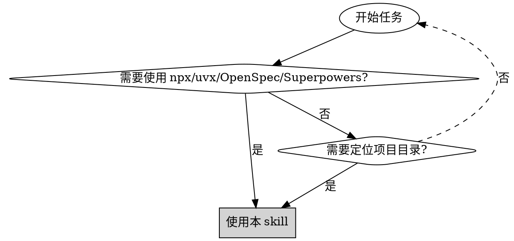
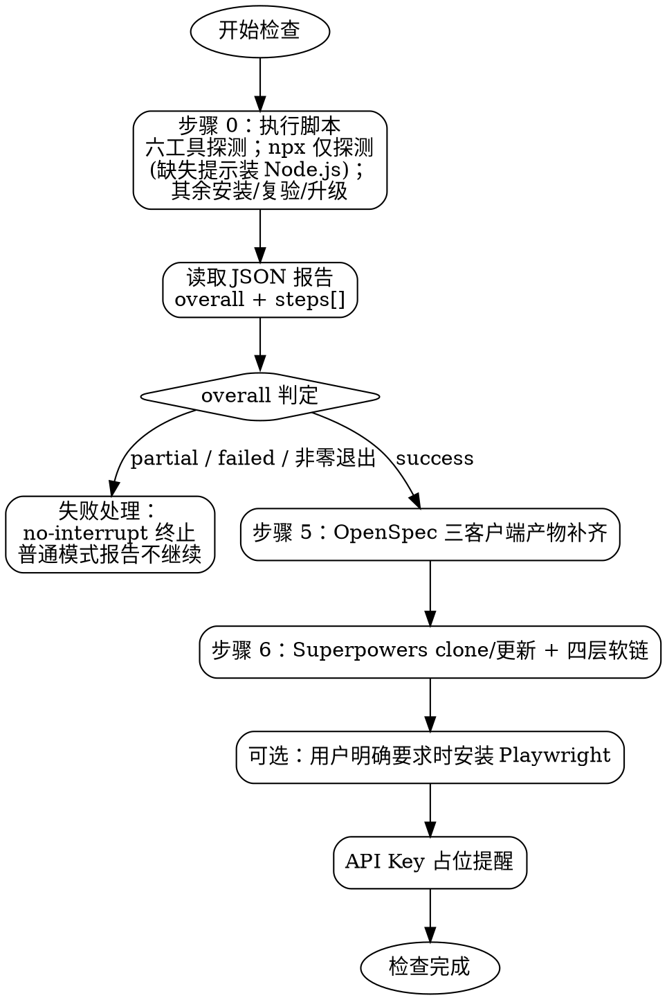

# 前置条件检查

## 概述

自动化环境检查和配置工具，确保项目所需的工具、依赖项、OpenSpec 指令文件和 Superpowers Skills 正确安装。默认使用无人工交互策略完成初始化。

## 参数模式

支持以下调用方式：

```text
/pre-check
/pre-check no-interrupt
/pre-check --no-interrupt
```

- 命令参数包含完整 token `no-interrupt` 或 `--no-interrupt`：进入 `no-interrupt` 模式。
- 未携带上述参数：进入普通模式，完整遵循本 Skill 修改前的检查、交互、增量安装、冲突跳过策略；单项工具失败不阻塞其他检查项的就绪探测，但整体判定为失败（`overall` 为 `partial`/`failed` 或任一步骤 failed）时不得进入 OpenSpec、Superpowers 等下游步骤（详见步骤 0 判定规则）。
- 两种模式互斥；不得把 `no-interrupt` 规则应用到普通模式。

### no-interrupt 通用规则

- 禁止调用 `AskUserQuestion`、`request_user_input` 或等价用户提问工具。
- 禁止等待用户输入、设置交互超时或通过推荐默认值继续。
- 不询问、不收集 API Key、Token、密码等私密信息。
- 不绕过操作系统权限、网络授权或执行平台安全限制；缺少必要条件时按失败处理。
- 失败报告必须包含失败步骤、失败原因、已完成步骤和恢复建议，不得宣称初始化成功。

### no-interrupt 强制完成策略

除 Playwright 外，六个基础检查都是完成门槛。已安装且验证通过视为完成，不重复安装；缺失时必须安装并验证。任一项失败立即终止 `/pre-check`，不执行剩余检查、API Key 提醒或下游初始化 Skill。

| 项目 | 完成条件 | 失败动作 |
|------|----------|----------|
| 六个基础工具 | 脚本 `run --no-interrupt` 退出码为 0 且 JSON `overall=success` | 立即终止 |
| OpenSpec 三客户端产物 | claude/codex/pi 三客户端目标指令文件验证成功（`openspec/config.yaml` 缺失不算失败，仅提示由 rule-config 创建） | 立即终止 |
| Superpowers | 来源目录和四层 Skills 软链验证成功 | 立即终止 |
| Playwright | 仅用户明确要求时安装和验证 | 未要求时允许跳过 |

`no-interrupt` 模式不得把安装失败、验证失败或配置冲突降级为警告后继续。

### no-interrupt Superpowers 处理

1. 先验证 `~/.agents/superpowers/skills`；有效时按现有同步逻辑完成四层软链。
2. 来源目录无效或缺失时，尝试在线 clone 或 Git 更新。
3. 在线操作失败后，只允许校验固定离线目录 `~/.agents/superpowers/skills`，不询问其他离线来源路径。
4. 固定离线目录仍无效时立即报错，终止 `/pre-check`。
5. Superpowers 来源目录或软链目标存在同名非软链内容时，将冲突内容重命名为 `<原名称>.cadence-backup-YYYYMMDDHHMMSS`，再创建正确目录或软链并验证。
6. 备份、创建或验证任一步失败时立即终止；禁止删除原内容，也禁止跳过冲突项继续。

**核心原则**：检查-验证-安装-同步-记录

**强制规则**：
1. **所有交互必须使用中文** - 提示、错误消息、用户询问一律中文
2. **必须完成所有六个基础检查** - 不允许跳过 npx/uvx/ast-grep/codegraph/openspec/superpowers 任一步骤
3. **必须支持增量运行** - 老项目重新运行 `/pre-check` 时，只补齐缺失能力，不重装、不覆盖已就绪配置
4. **Superpowers 必须支持离线安装** - 用户可手动复制 `superpowers` 到 `~/.agents/superpowers`
5. **Playwright 默认跳过** - 仅用户明确要求浏览器自动化能力时才安装 playwright-cli 与 skills
6. **API Key 配置默认占位** - 不询问、不收集真实密钥；mcp-configuration 默认写入智普/MiniMax API Key 占位配置，并提醒用户后续自行替换

## 人工交互策略

> 本节仅适用于未携带 `no-interrupt` 或 `--no-interrupt` 的普通模式。

默认不向用户提问。只有出现以下情况才进入人工交互：

| 触发条件 | 处理方式 |
|----------|----------|
| 在线安装失败且存在离线安装路径选择 | 询问用户是否已准备离线目录；无法等待时报告离线复制路径并继续其他检查 |
| Superpowers 目标目录存在同名非软链 | 不覆盖；如用户明确要求替换，再询问并执行 |
| 用户明确要求安装 Playwright | 检查并安装；安装失败时提供手动命令 |
| 需要真实 API Key、Token 或私密信息 | 不询问真实密钥，只提醒后续替换占位符 |

提问规则：
- 每次只问一个问题。
- 问题必须给出推荐默认选项。
- 如果运行环境支持自动超时，超时后采用推荐默认值。
- 如果无法等待用户输入，采用保守默认：不覆盖、不删除、不收集真实密钥、不启用 Playwright。

## 何时使用



**使用场景**：环境初始化、CI/CD 环境准备、新开发者环境搭建、新版 Cadence 工具补齐、OpenSpec 指令文件补齐、Superpowers Skills 同步

**不适用场景**：全部工具已确认安装、仅需检查单个工具、非开发环境

## 增量运行

`/pre-check` 支持重复执行。每个工具独立检查，**已安装或已同步的项目会直接跳过，只补装、补齐、更新缺失项**，不会重复安装或破坏已有配置。

增量原则：
- 已就绪：跳过并报告当前状态。
- 缺失：安装、初始化或补齐。
- 部分存在：只修复缺失部分。
- 冲突存在：不覆盖用户文件，中文警告并给出人工处理建议。
- 单项失败：报告失败和手动命令，其他已就绪项不回滚。
- 脚本化执行：六个基础工具由 `<PRE_CHECK_SH>`（pre-check skill 的关联脚本，完整绝对路径）毫秒级本地版本探测，已就绪工具秒跳过、不查远端、不重装；仅缺失或携带 `--upgrade` 时才执行安装/升级。

典型场景：
- 框架新增 `ast-grep` 后，老项目重新运行 `/pre-check`，只会自动安装 `ast-grep`，不会影响已有的 `npx`、`uvx`、`playwright-cli`。
- 框架新增 `codegraph` 后，老项目重新运行 `/pre-check`，只会自动安装 `codegraph`，不会影响已有工具。
- 框架新增 OpenSpec pi 支持后，老项目重新运行 `/pre-check`：缺少 `.pi` 产物时先执行 `openspec init --tools pi`，再执行 `openspec update`；若 pi 产物已存在，则直接执行 `openspec update`。新项目或三客户端产物均缺失时执行 `openspec init --tools claude,codex,pi`。
- 框架新增 Superpowers 后，老项目重新运行 `/pre-check`，只会更新或识别 `~/.agents/superpowers`，补齐 `~/.agents/skills`、`~/.codex/skills/skills`、`~/.claude/skills`、`~/.pi/agent/skills` 的软链。
- 某个工具安装失败后修复了环境问题，重新运行 `/pre-check` 会再次尝试安装或同步该工具。

## 检查流程



## 快速参考

| 步骤 | 检查命令或路径 | 成功标志 | 失败处理 |
|------|----------------|----------|----------|
| **1-6. 基础工具** | `bash <PRE_CHECK_SH> run [--mirror cn]` | JSON `overall=success` 且六工具 status 就绪 | 脚本统一安装/复验；失败按模式处理 |
| （含 npx/uvx/ast-grep/codegraph/openspec/pi-mcp-adapter） | `--upgrade` 升级 npm 系 + uv | `steps[].status` ∈ ready/installed/upgraded/skipped | 见步骤 0 |
| **5. OpenSpec** | `openspec --version`、三客户端产物状态 | CLI 和所需指令文件存在；`openspec/config.yaml` 缺失仅提示不影响判定 | 按缺失客户端 `init --tools <缺失客户端>` 后 `update` |
| **6. Superpowers** | `~/.agents/superpowers/skills` | 四层软链同步完成 | 在线 clone；失败时提示离线复制 |
| **可选. playwright-cli** | 用户明确要求时检查 `playwright-cli --help` | 输出帮助信息 | 自动全局安装并安装 skills |
| **默认提醒. API Key** | 展示占位配置提醒 | 用户后续自行替换真实密钥 | 不收集、不验证密钥 |

## 实施步骤

### 步骤 0：执行脚本完成六个基础工具检查

六个基础工具（npx、uvx、ast-grep、codegraph、openspec CLI、pi-mcp-adapter）的就绪探测、缺失安装与安装后复验统一由脚本完成，不再逐条执行安装命令。

**自包含原则（关键）**：Agent 的每条命令都在**独立 shell** 中执行，工作目录（cwd）、环境变量、上一条命令的状态**都不跨命令保留**。因此本 Skill 的每条命令都必须**完全自包含**：用绝对路径，不依赖 cwd，不依赖环境变量，不依赖前一条命令设置的任何东西。

**第一步——确定两个字面路径（模型先执行一次，记住字面值，后续每条命令直接写出）**：

1. **项目根 `<PROJECT_ROOT>`**：待初始化项目的绝对路径。先执行 `pwd`（或 `pwd -P`）得到它，例如 `/home/user/my-project`。所有 openspec 产物、`.claude/.codex/.pi`、报告文件都落在该目录。
2. **脚本 `<PRE_CHECK_SH>`**：脚本是本 pre-check skill 的关联脚本，位于 pre-check skill 目录下的 `scripts/pre-check.sh`。模型根据自身安装环境定位 skill 目录并拼出完整绝对路径（例如 `<skill 安装根>/cadence-init/skills/pre-check/scripts/pre-check.sh`）。脚本只读，**不要** `cd` 进 skill 目录。

**第二步——确定独占报告路径 `<REPORT>`**：为避免并发/重复运行互相覆盖，报告用**每次调用独占**的绝对路径 `<PROJECT_ROOT>/.precheck-report-<时间戳>.json`。执行一次 `echo "$(pwd)/.precheck-report-$(date +%s).json"` 得到字面值并记住，后续命令直接写出它。

**调用命令**：按需选择下面**其中一条**执行（不要全部顺序执行，尤其不要误跑 `--upgrade`）。把 `<PRE_CHECK_SH>` 与 `<REPORT>` 替换为上面记住的字面值：

```bash
# 通用源，普通模式
bash <PRE_CHECK_SH> run > <REPORT>

# 大陆镜像源
bash <PRE_CHECK_SH> run --mirror cn > <REPORT>

# no-interrupt 模式（任一基础工具失败即非零退出）
bash <PRE_CHECK_SH> run --mirror cn --no-interrupt > <REPORT>

# 仅探测不安装（摸底）
bash <PRE_CHECK_SH> check --mirror cn > <REPORT>

# 升级已装工具到当前源 latest（npm 系 + uv 本体）
bash <PRE_CHECK_SH> run --mirror cn --upgrade > <REPORT>
```

脚本向 stdout 输出单份 JSON，重定向到 `<REPORT>`（项目根下的独占绝对路径）；stderr 彩色摘要直接显示。

**读取结果**：报告 JSON 已写入独占路径 `<REPORT>`。用以下命令取 overall 与各工具状态（每条命令自包含，写出 `<REPORT>` 字面值）：

```bash
# overall（success/partial/failed）
python3 -c "import json;print(json.load(open('<REPORT>'))['overall'])"
# 某工具状态
python3 -c "import json;d=json.load(open('<REPORT>'));print([s for s in d['steps'] if s['name']=='ast-grep'])"
# Superpowers 远端地址（供步骤 6 使用）
python3 -c "import json;print(json.load(open('<REPORT>'))['hints']['superpowers_git'])"
```

**报告生命周期**：报告是临时文件，用于后续 Superpowers 步骤读取镜像地址、以及向用户汇报初始化结果。无论成功或失败，完成后都删除该次调用的独占文件（`<REPORT>` 是含时间戳的字面值）：
- 成功路径：全部检查完成后 `rm -f <REPORT>`。
- 失败路径：任一失败终止或报告后，同样 `rm -f <REPORT>`，避免残留。

**JSON 结构**（权威）：`overall`（success/partial/failed）、`steps[]`（每项 `name`/`status`/`action`/`version`/`error`，status 枚举 ready/installed/upgraded/skipped/failed）、`next_actions`、`hints.superpowers_git`。

**判定规则**：
- `overall=success` 且六工具 status 均为 ready/installed/upgraded/skipped：基础工具门槛通过，继续步骤 5 的 OpenSpec 三客户端检查与步骤 6 的 Superpowers 同步。
- `overall` 为 `partial` 或 `failed`，或任一 `steps[].status=failed`，或脚本非零退出：no-interrupt 模式立即终止 `/pre-check` 并报告失败；普通模式报告失败项与恢复建议，**不得继续后续步骤，不宣称成功**。
- pi-mcp-adapter 的 `status=skipped`（action=pi-not-found）不算失败。

### 可选步骤：检查 playwright-cli

> 默认不执行。仅当用户明确要求浏览器自动化、截图、表单填写、端到端测试能力时执行。

```bash
playwright-cli --help
```

**行为（中文输出）**：
- 未明确要求：报告 "✓ 默认跳过 playwright-cli 安装，可稍后按需启用"
- 已明确要求且已安装：报告 "✓ playwright-cli 已安装"
- 已明确要求但未安装：报告 "正在安装 playwright-cli..."，执行全局安装与 skills 安装，完成后报告 "✓ playwright-cli 与 skills 安装成功"

**安装命令**：

> **执行位置**：`npm install -g` 为全局安装（任意目录均可）；`playwright-cli install --skills` 的 skills 产物写入当前项目，须 `cd <PROJECT_ROOT>`（项目根绝对路径）后执行，确保在独立 shell 下落到项目根。

```bash
npm install -g @playwright/cli@latest        # 全局安装 CLI（任意目录均可）
cd <PROJECT_ROOT> && playwright-cli install --skills   # skills 产物写入项目根，须 cd <PROJECT_ROOT>
```

**验证安装**：

```bash
playwright-cli --help
ls ~/.claude/skills/playwright-cli
```

**说明**：

- **用途**：浏览器自动化测试、表单填写、截图、数据提取
- **特点**：Token-efficient，不会强制将页面数据加载到 LLM
- **Skills**：安装后 Claude Code 可自动识别并使用 Playwright skills
- **默认行为**：不安装、不启用；需要时由用户显式要求

### 步骤 5：检查 OpenSpec

```bash
openspec --version
```

**行为（中文输出）**：
- CLI 已安装：报告 "✓ OpenSpec CLI 已安装（版本：{版本号}）"
- CLI 未安装：openspec CLI 由步骤 0 脚本统一安装与验证；本节仅在 CLI 就绪后执行三客户端产物检查
- `openspec/config.yaml` 不存在：报告 "✓ openspec/config.yaml 尚未创建，将由 rule-config 步骤 11 创建（含 Cadence 协作规则上下文），不阻塞本检查"

**安装**：openspec CLI 由步骤 0 脚本统一安装与验证（见 `steps[]` 中 `name=openspec` 项）；CLI 未就绪时先回到步骤 0 处理，再继续本节三客户端产物检查。

**初始化与更新命令**：

> **执行位置**：`openspec init`/`openspec update` 作用于当前工作目录，产物（`.claude/.codex/.pi`）写入该目录。为在独立 shell 下确保落到项目根，每条命令用 `cd <PROJECT_ROOT> && ...` 自包含（`<PROJECT_ROOT>` 为步骤 0 确定的项目根绝对路径字面值）。

```bash
# 三客户端产物均缺失（新项目）
cd <PROJECT_ROOT> && openspec init --tools claude,codex,pi

# 仅 pi 产物缺失
cd <PROJECT_ROOT> && openspec init --tools pi && openspec update

# 三客户端产物齐全
cd <PROJECT_ROOT> && openspec update
```

**增量要求**：

按 claude、codex、pi 三客户端分别检测指令产物存在性，`openspec/config.yaml` 是否存在不作为分支判断条件：

| 客户端 | 产物就绪判定 |
|--------|--------------|
| claude | `.claude/commands/opsx/` 存在，或 `.claude/skills/` 下存在 `openspec-*` 目录 |
| codex | `.codex/skills/` 下存在 `openspec-*` 目录 |
| pi | `.pi/skills/` 下恰有 5 个 `openspec-*` 目录，且 `.pi/prompts/` 下恰有 5 个 `opsx-*.md` 文件 |

- 存在缺失客户端：对缺失客户端执行 `openspec init --tools <缺失客户端列表>`（如 `claude,codex,pi`、`pi`），再执行 `openspec update`。
- 三客户端产物均齐全：直接执行 `openspec update`。
- 已就绪客户端不得重新 init，不覆盖用户改动。
- `openspec init` 检测到 `openspec/config.yaml` 已存在时原样保留（CLI 行为），不覆盖 rule-config 写入的内容。
- `openspec update` 只刷新已初始化的工具产物，不能为未初始化的客户端新增产物；缺失客户端必须由 `openspec init` 补齐。
- OpenSpec 生成的 Claude Code、Codex 和 pi 目录结构不同，不能混用：
  - Claude Code：`.claude/commands/opsx/`、`.claude/skills/openspec-*`
  - Codex：`.codex/skills/openspec-*`
  - pi：`.pi/prompts/opsx-*`、`.pi/skills/openspec-*`
- `--tools pi` 需要 OpenSpec CLI >= 1.4.1；步骤 0 脚本始终安装 `@fission-ai/openspec@latest`，版本不足时先回到步骤 0 升级 CLI。
- 已存在的 OpenSpec skills 或 commands 不删除、不覆盖用户改动；如 `openspec update` 产生冲突，报告冲突并提示用户手动处理。

**验证命令**：

```bash
cd <PROJECT_ROOT> && openspec --version
cd <PROJECT_ROOT> && test -f .codex/skills/openspec-propose/SKILL.md
cd <PROJECT_ROOT> && test -f .claude/commands/opsx/propose.md -o -f .claude/skills/openspec-propose/SKILL.md
cd <PROJECT_ROOT> && test -f .pi/skills/openspec-propose/SKILL.md
cd <PROJECT_ROOT> && test "$(find .pi/skills -mindepth 1 -maxdepth 1 -type d -name 'openspec-*' | wc -l | tr -d ' ')" = 5
cd <PROJECT_ROOT> && test "$(find .pi/prompts -mindepth 1 -maxdepth 1 -type f -name 'opsx-*.md' | wc -l | tr -d ' ')" = 5
```

> 说明：`openspec/config.yaml` 由 rule-config 步骤 11 创建与合并，不属于本检查的完成条件；缺失时仅按"行为（中文输出）"输出提示。

### 步骤 6：检查 Superpowers

**目录约定**：

| 用途 | 路径 |
|------|------|
| Superpowers 源目录 | `~/.agents/superpowers` |
| 统一 Skills 目录 | `~/.agents/skills` |
| Codex 目标目录 | `~/.codex/skills/skills` |
| Claude Code 目标目录 | `~/.claude/skills` |
| pi 目标目录 | `~/.pi/agent/skills` |

**在线安装来源**：

> **执行位置与产物**：clone 产物落在 `$HOME/.agents/superpowers`（绝对路径，不受执行目录影响）。报告路径用步骤 0 确定的 `<REPORT>`（项目根下独占绝对路径字面值）；若该文件不存在，先回步骤 0 生成报告再读本节。

```bash
# 单条命令自包含：从 <REPORT> 读出 Superpowers 远端地址并 clone（同一 shell 内完成）
git clone "$(python3 -c "import json;print(json.load(open('<REPORT>'))['hints']['superpowers_git'])")" "$HOME/.agents/superpowers"
```

Superpowers 远端地址必须从 `<REPORT>` 的 `hints.superpowers_git` 读出；使用 cn 镜像时直接 clone 国内地址，不配置 git 代理、不修改 git 全局配置。

**离线安装方式**：

用户可自行下载或复制 Superpowers 到：

```bash
$HOME/.agents/superpowers
```

只要存在以下目录，即视为有效离线来源：

```bash
$HOME/.agents/superpowers/skills
```

**行为（中文输出）**：
- `~/.agents/superpowers/.git` 存在：执行 Git 更新逻辑，然后同步软链。
- `~/.agents/superpowers/.git` 不存在但 `~/.agents/superpowers/skills` 存在：报告 "检测到 Superpowers 离线安装目录，跳过 Git 更新"，继续同步软链。
- `~/.agents/superpowers/skills` 不存在：尝试在线 clone；如果失败，提示用户离线复制 Superpowers 到 `~/.agents/superpowers` 后重新运行 `/pre-check`。

**Git 更新逻辑**：

> 单条命令自包含：用 `git -C <dir>` 在指定仓库上操作，不 `cd`、不依赖前一条命令的变量或工作目录；报告路径用 `<REPORT>`（步骤 0 的独占绝对路径字面值）。

```bash
# 从 <REPORT> 读出远端地址并更新（同一 shell 内完成，cn 模式走国内镜像而非残留的原 origin）
git -C "$HOME/.agents/superpowers" remote set-url origin "$(python3 -c "import json;print(json.load(open('<REPORT>'))['hints']['superpowers_git'])")" && \
git -C "$HOME/.agents/superpowers" fetch origin && \
git -C "$HOME/.agents/superpowers" pull --ff-only origin "$(git -C "$HOME/.agents/superpowers" rev-parse --abbrev-ref HEAD)"
```

**软链同步逻辑**：

1. 确保 `~/.agents/skills`、`~/.codex/skills/skills`、`~/.claude/skills`、`~/.pi/agent/skills` 存在。
2. 将 `~/.agents/superpowers/skills/*` 逐项软链到 `~/.agents/skills`。
3. 将 `~/.agents/skills/*` 中指向 Superpowers 的软链逐项软链到 `~/.codex/skills/skills`。
4. 将 `~/.agents/skills/*` 中指向 Superpowers 的软链逐项软链到 `~/.claude/skills`。
5. 将 `~/.agents/skills/*` 中指向 Superpowers 的软链逐项软链到 `~/.pi/agent/skills`。
6. 已存在正确软链：跳过。
7. 已存在旧软链但指向不同 Superpowers 来源：更新软链。
8. 已存在同名非软链文件或目录：跳过并警告，不覆盖。
9. 清理失效软链时，只清理指向 `~/.agents/superpowers/skills` 或 `~/.agents/skills` 中 Superpowers 条目的失效链接，不能删除 OpenSpec、Cadence 或用户自定义 skills。

> 说明：pi 原生也会读取 `~/.agents/skills`，此处显式软链到 `~/.pi/agent/skills` 是为了与 Claude Code/Codex 保持一致的显式布局，便于统一检查、更新与失效清理。

**验证命令**：

```bash
test -d "$HOME/.agents/superpowers/skills"
test -d "$HOME/.agents/skills"
test -d "$HOME/.codex/skills/skills"
test -d "$HOME/.claude/skills"
test -d "$HOME/.pi/agent/skills"
```

**增量要求**：
- 重新运行 `/pre-check` 时，已有正确软链必须跳过。
- 只补齐缺失软链或更新指向旧来源的软链。
- 离线安装目录有效时，不要求 `.git` 存在，不尝试 Git 更新。
- 在线 clone 或 Git 更新失败时，不删除已有离线目录或已有软链。

### 默认步骤：API Key 占位配置提醒

> **⚠️ 默认执行提醒** — 不主动询问用户是否需要，不要求用户输入真实 API Key，不阻塞初始化。

默认使用中文展示以下提醒：

**智普 AI MCP（视觉理解/联网搜索/网页读取/开源仓库）**
- 提醒用户前往 https://open.bigmodel.cn/usercenter/apikeys 获取 API Key
- 告知用户需要订阅 GLM Coding Plan
- 报告 "⚠️ mcp-configuration 将写入 your_zhipu_api_key 占位符，请稍后自行替换为真实密钥"
- **不验证密钥有效性，仅做提醒**

**MiniMax Token Plan MCP（网络搜索/图片理解）**
- 提醒用户前往 https://platform.minimaxi.com/subscribe/token-plan 订阅并获取 API Key
- 报告 "⚠️ mcp-configuration 将写入 your_minimax_api_key 占位符，请稍后自行替换为真实密钥"
- **不验证密钥有效性，仅做提醒**

**默认行为**：
- 报告 "✓ 默认使用 API Key 占位符完成初始化，不收集真实密钥"

**安全提醒（必须展示）**：
```
🔴 安全提醒：请不要将 API Key 直接告诉 Claude Code。
稍后在 MCP 配置步骤中，配置文件会使用占位符，您需要自行替换为真实密钥。
```

## 常见错误

| 错误 | 原因 | 解决方案 |
|------|------|----------|
| **npx 安装失败** | Node.js 未安装 | 先安装 Node.js |
| **uvx 安装失败** | Python/pip 不可用 | 先安装 Python |
| **ast-grep 安装失败** | Node.js/npm 不可用或网络问题 | 检查 Node.js 环境后重新运行 `bash <PRE_CHECK_SH> run` |
| **codegraph 安装失败** | Node.js/npm 不可用或网络问题 | 检查 Node.js 环境后重新运行 `bash <PRE_CHECK_SH> run` |
| **OpenSpec 安装失败** | Node.js/npm 不可用或网络问题 | 检查 Node.js 环境后重新运行 `bash <PRE_CHECK_SH> run` |
| **OpenSpec 更新失败** | 指令文件冲突或项目目录不可写 | 保留现有文件，提示用户处理冲突后重新运行 `/pre-check` |
| **Superpowers 在线安装失败** | GitHub 网络不可用或 git 不可用 | 手动复制 Superpowers 到 `~/.agents/superpowers` 后重新运行 `/pre-check` |
| **Superpowers 同名非软链冲突** | 目标目录已有用户文件或目录 | 跳过该项并提示用户手动决定是否替换 |
| **pi-mcp-adapter 安装失败** | pi 可执行文件不可用或网络问题 | 确认 `command -v pi` 成功后重新运行 `bash <PRE_CHECK_SH> run`，或修复 pi 环境后重新运行 `/pre-check` |
| **playwright-cli 安装失败** | Node.js/npm 不可用或网络问题 | 仅在用户明确要求 Playwright 时报告，并提供手动安装命令 |
