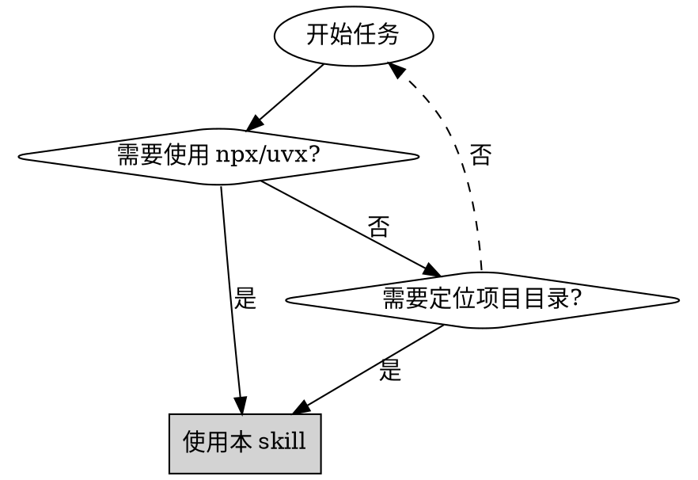
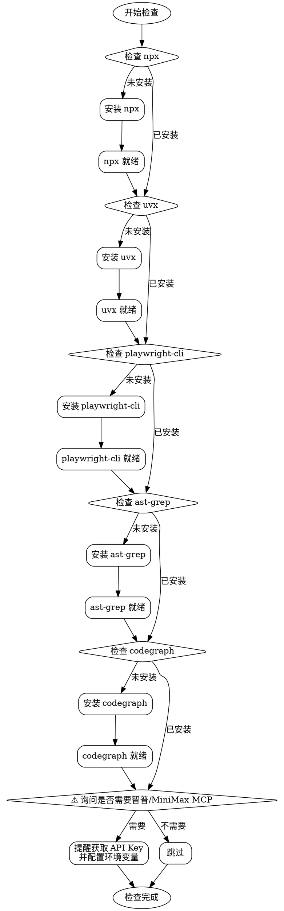

# 前置条件检查

## 概述

自动化环境检查和配置工具，确保项目所需的工具和依赖项正确安装。

**核心原则**：检查-验证-安装-记录

**强制规则**：
1. **所有交互必须使用中文** - 提示、错误消息、用户询问一律中文
2. **必须完成所有五个基础检查** - 不允许跳过 npx/uvx/playwright-cli/ast-grep/codegraph 任一步骤
3. **API Key 配置为可选步骤** - 询问用户是否需要智普/MiniMax MCP，仅做配置提醒

## 何时使用



**使用场景**：环境初始化、CI/CD 环境准备、新开发者环境搭建、新版 Cadence 工具补齐

**不适用场景**：全部工具已确认安装、仅需检查单个工具、非开发环境

## 增量运行

`/pre-check` 支持重复执行。每个工具独立检查，**已安装的工具会直接跳过，只补装缺失的工具**，不会重复安装或破坏已有配置。

典型场景：
- 框架新增 `ast-grep` 后，老项目重新运行 `/pre-check`，只会自动安装 `ast-grep`，不会影响已有的 `npx`、`uvx`、`playwright-cli`。
- 框架新增 `codegraph` 后，老项目重新运行 `/pre-check`，只会自动安装 `codegraph`，不会影响已有的 `npx`、`uvx`、`playwright-cli`、`ast-grep`。
- 某个工具安装失败后修复了环境问题，重新运行 `/pre-check` 会再次尝试安装该工具。

## 检查流程



## 快速参考

| 步骤 | 检查命令 | 成功标志 | 失败处理 |
|------|---------|---------|---------|
| **1. npx** | `npx --version` | 输出版本号 | 自动安装稳定版本 |
| **2. uvx** | `uvx --version` | 输出版本号 | 自动安装稳定版本 |
| **3. playwright-cli** | `playwright-cli --help` | 输出帮助信息 | 自动全局安装并安装 skills |
| **4. ast-grep** | `ast-grep --version` | 输出版本号 | 自动全局安装 `@ast-grep/cli` |
| **5. codegraph** | `codegraph version` | 输出版本号 | 自动全局安装 `@colbymchenry/codegraph` |
| **6. API Key（可选）** | 询问用户 | 用户确认已获取 | 跳过或提供获取地址 |

## 实施步骤

### 步骤 1：检查 npx

```bash
npx --version
```

**行为（中文输出）**：
- ✅ **已安装**：报告 "✓ npx 已安装（版本：{版本号}）"
- ❌ **未安装**：报告 "正在安装 npx..."，自动安装，完成后报告 "✓ npx 安装成功"

### 步骤 2：检查 uvx

```bash
uvx --version
```

**行为（中文输出）**：
- ✅ **已安装**：报告 "✓ uvx 已安装（版本：{版本号}）"
- ❌ **未安装**：报告 "正在安装 uvx..."，自动安装，完成后报告 "✓ uvx 安装成功"

### 步骤 3：检查 playwright-cli

```bash
playwright-cli --help
```

**行为（中文输出）**：
- ✅ **已安装**：报告 "✓ playwright-cli 已安装"
- ❌ **未安装**：报告 "正在安装 playwright-cli..."，执行全局安装并安装 skills，完成后报告 "✓ playwright-cli 安装成功"

**安装命令**：

```bash
npm install -g @playwright/cli@latest
playwright-cli install --skills
```

### 步骤 4：检查 ast-grep

```bash
ast-grep --version
```

**行为（中文输出）**：
- ✅ **已安装**：报告 "✓ ast-grep 已安装（版本：{版本号}）"
- ❌ **未安装**：报告 "正在安装 ast-grep..."，执行 `npm i @ast-grep/cli -g`，完成后报告 "✓ ast-grep 安装成功"

**安装命令**：

```bash
npm i @ast-grep/cli -g
```

### 步骤 5：检查 codegraph

```bash
codegraph version
```

**行为（中文输出）**：
- ✅ **已安装**：报告 "✓ codegraph 已安装（版本：{版本号}）"
- ❌ **未安装**：报告 "正在安装 codegraph..."，执行 `npm i -g @colbymchenry/codegraph`，完成后报告 "✓ codegraph 安装成功"

**安装命令**：

```bash
npm i -g @colbymchenry/codegraph
```

**增量要求**：
- 如果老项目已完成 `/pre-check`，重新运行时必须跳过已安装工具，只补装缺失的 codegraph。
- codegraph 安装后只验证 codegraph，不重新安装 npx/uvx/playwright-cli/ast-grep。

### 步骤 6：API Key 配置提醒（可选）

> **⚠️ 可选步骤** — 仅在用户需要智普/MiniMax MCP 时执行

使用 AskUserQuestion 工具（**必须使用中文**）询问用户是否需要以下可选 MCP：

**选项 1：需要智普 AI MCP（视觉理解/联网搜索/网页读取/开源仓库）**
- 提醒用户前往 https://open.bigmodel.cn/usercenter/apikeys 获取 API Key
- 告知用户需要订阅 GLM Coding Plan
- 报告 "⚠️ 请自行获取智普 API Key，稍后在 MCP 配置步骤中将使用此密钥"
- **不验证密钥有效性，仅做提醒**

**选项 2：需要 MiniMax Token Plan MCP（网络搜索/图片理解）**
- 提醒用户前往 https://platform.minimaxi.com/subscribe/token-plan 订阅并获取 API Key
- 报告 "⚠️ 请自行获取 MiniMax API Key，稍后在 MCP 配置步骤中将使用此密钥"
- **不验证密钥有效性，仅做提醒**

**选项 3：都不需要，跳过**
- 报告 "✓ 跳过可选 MCP 配置"

**安全提醒（如果用户选择了选项 1 或 2，必须展示）**：
```
🔴 安全提醒：请不要将 API Key 直接告诉 Claude Code。
稍后在 MCP 配置步骤中，配置文件会使用占位符，您需要自行替换为真实密钥。
```

## 常见错误

| 错误 | 原因 | 解决方案 |
|------|------|---------|
| **npx 安装失败** | Node.js 未安装 | 先安装 Node.js |
| **uvx 安装失败** | Python/pip 不可用 | 先安装 Python |
| **playwright-cli 安装失败** | Node.js/npm 不可用或网络问题 | 检查 Node.js 环境，或手动执行安装命令 |
| **ast-grep 安装失败** | Node.js/npm 不可用或网络问题 | 检查 Node.js 环境，或手动执行 `npm i @ast-grep/cli -g` |
| **codegraph 安装失败** | Node.js/npm 不可用或网络问题 | 检查 Node.js 环境，或手动执行 `npm i -g @colbymchenry/codegraph` |
